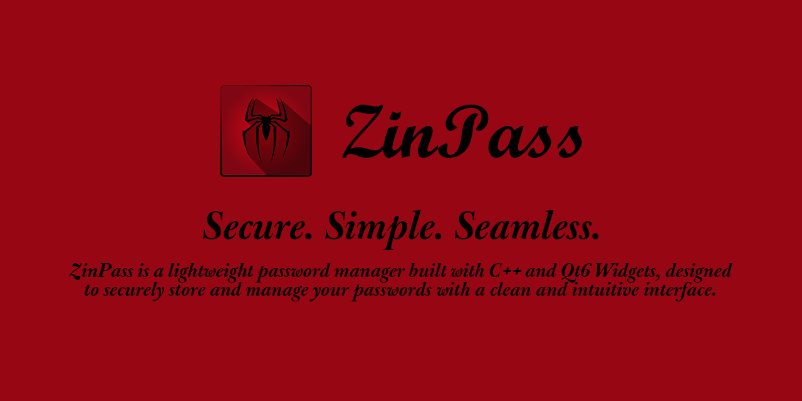
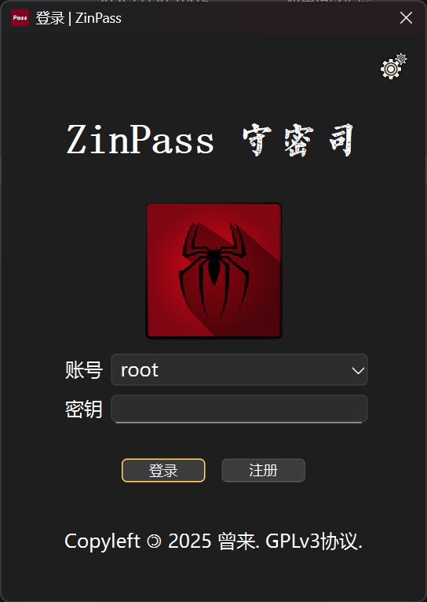
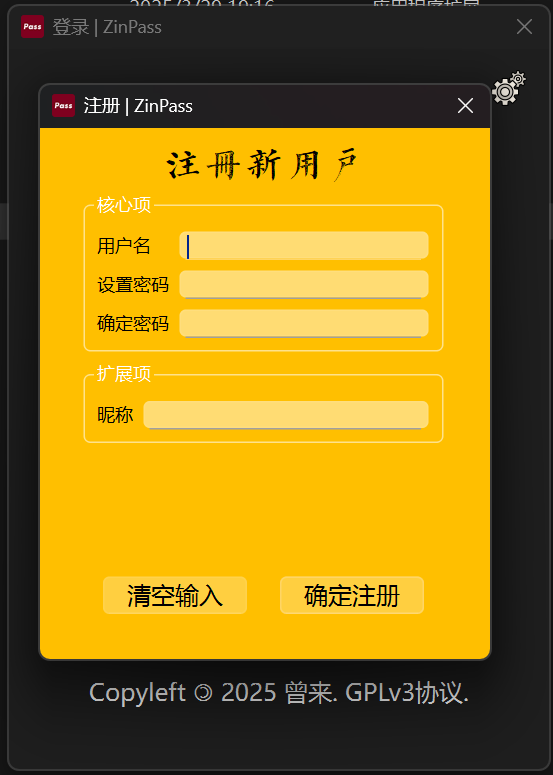
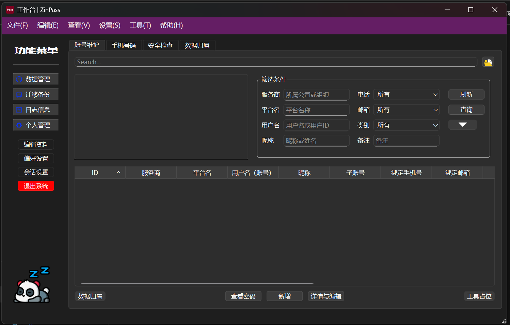
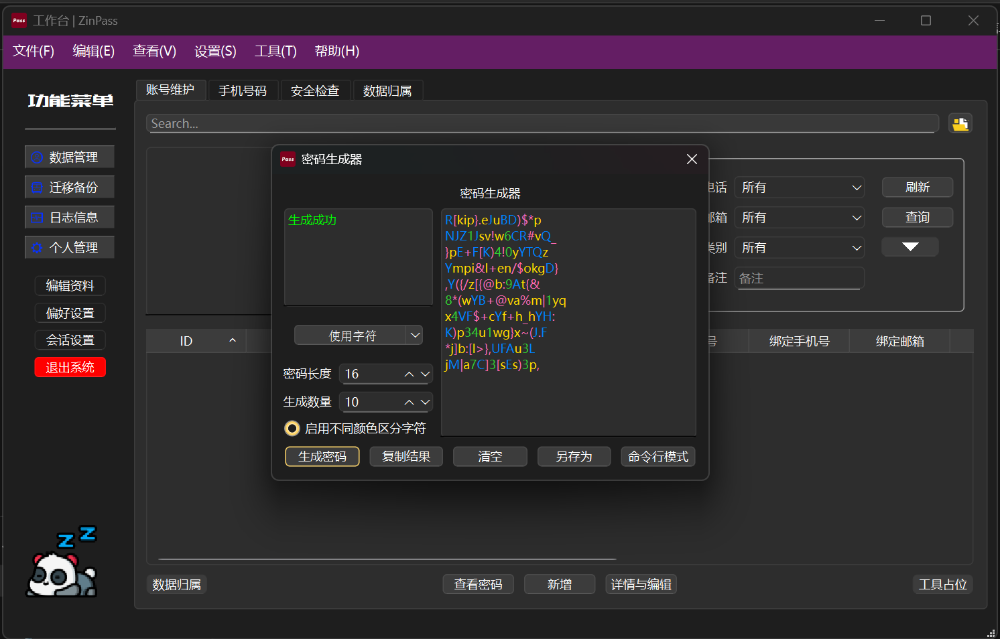
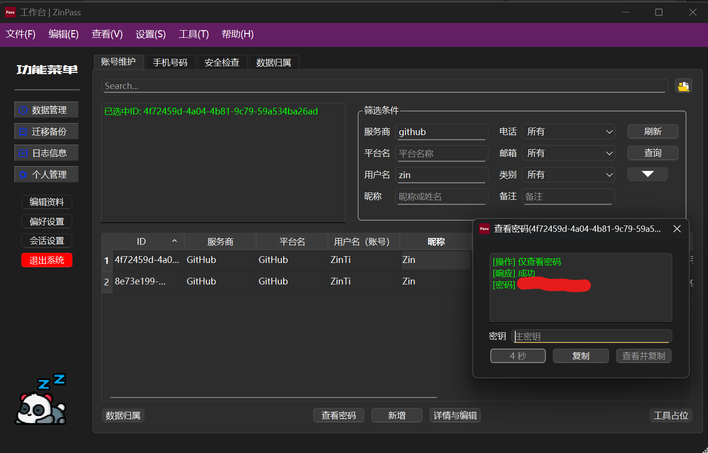

# ZinPass 密码管理器 v0.0.3-patch2

    
    
ZinPass is a lightweight password manager built with C++ and Qt6 Widgets, designed to securely store and manage your passwords with a clean and intuitive interface.

## 📇 一、简介
ZinPass 是一款轻量级密码管理器，分为三部分：
- 客户端：`zinpass.exe` 负责前端交互，使用 Qt6 框架 Widget 开发
- 服务端：`zinpasssvc.exe` 负责后端数据处理，使用 gRPC 与 前端以及命令行工具通信，使用 SQLite3 存储数据，使用 OpenSSL 加密数据（目前版本只加密密码字段，后续版本将改为加密整个文件）。
- 服务端命令行交互工具：`zinpassctl.exe` 负责监控和控制服务端后台进程。服务端没有控制台和图形化界面，监控和控制需要此工具。
这个程序只实现了少数几个最基本的功能，还有很多功能未实现，目前没啥精力更新，且每次更新大概率都是破坏性更新，完全不保证向后兼容，甚至不保证向前兼容。

## 🛠️ 二、构建
使用 CMake + MinGW-w64 构建，C++ 17 标准，构建前先运行 protoc.py 脚本生成 gRPC 的桩代码，然后再构建。

依赖以下库：
- Qt6
- gRPC (含 protoc 工具)
- SQLite3
- OpenSSL
- Boost

## ⚙️ 三、使用

***

  <!-- 左侧文本 -->
  

    
1、先双击运行 zinpasssvc.exe，启动服务端后台进程。双击 zinpasssvc.exe 后，服务端就启动了，因为运行在后台，所以不会显示任何控制台或图形界面，这是正常现象。

    
2、然后启动 zinpass.exe 客户端程序，登录或注册账号使用。登录界面如图 3-1 所示，账号处会自动列出所有已存在的用户名，请选择用户名，然后输入密码登录。

  

  <!-- 右侧图片和图注 -->
  

    
    
图3-1 登录界面

  

***

  <!-- 左侧文本 -->
  

    
3、对于第一次运行的用户，需要先注册账号，如图 3-2 所示，输入用户名、密码、确认密码、昵称等信息，点击注册按钮完成注册。

    
4、若用户需要关闭 zinpasssvc 进程，需要使用 zinpassctl.exe 工具，在该工具的交互命令中，输入 stop 命令即可通知服务器停止服务。

  

  <!-- 右侧图片和图注 -->
  

    
    
图3-2 注册界面

  

***

5、登录成功后即进入工作台界面，在工作台界面进行各种操作。工作台顶部为菜单栏，左侧为功能导航区，右侧为工作区。如图 3-3 所示。

<figure style="text-align: center;">
  
  <figcaption style="font-style: italic; font-size: smaller; margin-top: 5px;">图3-3 工作台界面</figcaption>
</figure>

6、需要注意的是，会话超时自动过期，会话过期时查询不到任何数据，客户端也不会提示会话过期，请自行退出重新登录（这一问题是设计缺陷，将在后续版本中解决）。

***

7、在工作台界面顶部菜单栏中，预留了一些菜单项，这些菜单项暂时没有实现，但保留了位置，以供以后扩展。其中 工具栏 - 密码生成器 功能已经实现，所以此处以密码生成器功能为例，展示一下其功能界面。如图 3-4 所示。

<figure style="text-align: center;">
  
  <figcaption style="font-style: italic; font-size: smaller; margin-top: 5px;">图3-4 工具-密码生成器</figcaption>
</figure>

8、密码生成器功能支持生成随机密码，你可以指定密码长度、生成数量、包含的字符类型（数字、大小写字母与特殊字符），根据需要选择不同的参数生成密码。可以点击命令行模式，提供了另一个独立的随机密码生成器的程序，就是 bin 目录下的 pwdgen 程序。

***

9、查看密码功能示例，支持 “查看 | 复制 | 查看并复制” 三种方式。查看密码后仅显示几秒钟，如图 3-5 所示。这样设计的目的是，有时候用户查看完密码，但来不及/忘记关闭窗口，此时屏幕可能会被恶意程序或不法分子窥窃到，因此设计了一个倒计时，且时间比较短。推荐使用复制功能，复制功能不会明文显示密码，可以粘贴到其他地方使用。不过复制也存在被其他程序读取粘贴板的风险，后续版本将会实现一个隔离的粘贴板，以防止数据泄露。

<figure style="text-align: center;">
  
  <figcaption style="font-style: italic; font-size: smaller; margin-top: 5px;">图3-5 读取密码</figcaption>
</figure>

10、密码数据不上传任何其他服务器，不会收集任何用户信息，虽然设计为客户端/服务器架构，但服务器可设计仅监听本机地址的请求，拦截外部请求，客户端也不会向任何其他网络服务器发送任何数据，一切都运行在本地主机，确保安全。

***

11、推荐用户要备份数据，直接备份 zinpass.db 这个文件就行，但是因为在发布正式版本之前，都不保证兼容前一版本，备份 zinpass.db 文件前请同时记录 zinpass.db 是配套哪个版本的软件。

12、本软件遵循 GPLv3 协议，任何人都可以自由使用、修改、分发本软件，但任何人修改后的软件都必须以 GPLv3 协议开源。若存在故障，请提交 issue 到 GitHub。

***

